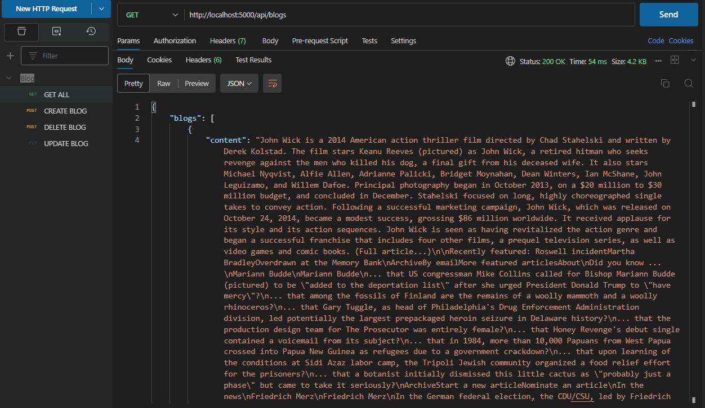
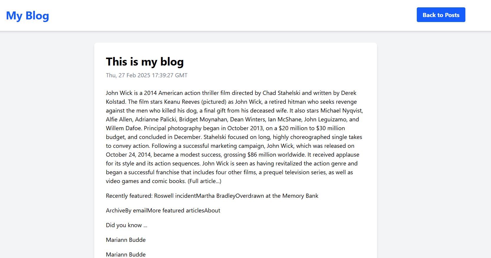

# Simple CRUD Blog Post Web Application

CRUD Blog Posts Web Application deals with the simple create, read, update and delete posts with user interactive blogs. In simple terms, users can add, remove and update their blogs with title and contents of their blogs. This is the demonstration of backend frontend integrations. With the help of Flask, SQL, Docker and React frameworks. 

# File Structures 

simple-crud-web-application/<br>
├── backend/<br>
│   ├── app/<br>
│   │   ├── app.py<br>
│   │   ├── db.py<br>
│   │   ├── models.py<br>
│   │   ├── routes.py<br>
│   ├── Dockerfile<br>
│   ├── docker-compose.yml<br>
│   ├── requirements.txt<br>
│   ├── venv/<br>
│   └── main.py<br>
├── frontend/<br>
│   ├── public/<br>
│   ├── src/<br>
│   │   ├── components/<br>
│   │   │   ├── Blog.jsx<br>
│   │   ├── App.js<br>
│   │   ├── index.js<br>
│   ├── package.json<br>
├── .gitignore<br>
├── README.md<br>


## Table of Contents

- [Objective](#objective)
- [Initial Setup](#initial-setup)
- [Backend Setup](#backend-setup)
- [Dockerization](#dockerization)
- [Running the Application](#running-the-application)
- [Screenshots](#screenshots)

## Objective

Build a web application that allows users to create, read, update, and delete (CRUD) blog posts.


## Backend Setup

1. **Set Up the Backend Framework:**
   - Choose and set up Flask.

2. **Set Up the Database:**
   - Use a SQLite database (PostgreSQL preferred) or any other database of your choice.

3. **Create a Blog Post Model:**
   - Define fields like:
     - `title`
     - `content`
     - `date`

4. **Implement API Endpoints:**
   - Create endpoints for CRUD operations on blog posts:
     - **Create**: Add a new blog post.
     - **Read**: Fetch blog posts (list or single post).
     - **Update**: Modify existing blog posts.
     - **Delete**: Remove blog posts.

5. **Pagination or Infinite Scrolling:**
   - Add pagination or infinite scrolling for the list of blog posts.

## Dockerization

1. **Create a Dockerfile:**
   - Write a `Dockerfile` to set up the backend environment (install dependencies, expose ports, etc.).

2. **Create a Docker Compose File:**
   - Use `docker-compose.yml` to define services for the backend and database.
   - Link the backend and database services.
   - Set up a database service (e.g., SQLite or PostgreSQL).

3. **Dockerize the Application:**
   - Build the Docker images and run the services with `docker-compose`.
   - Ensure that all components work together inside containers.

4. **Test Dockerized Application:**
   - Test the application running inside containers to verify it works as expected.

## Running the Application

### Backend

1. Navigate to the `backend` directory.
2. Create a virtual environment and activate it:
   ```sh
   python -m venv venv
   venv\Scripts\activate  # On Windows

### Screenshots

HTTP Request (GET) using Postman API Testing

<br>
Frontend Blogposts

